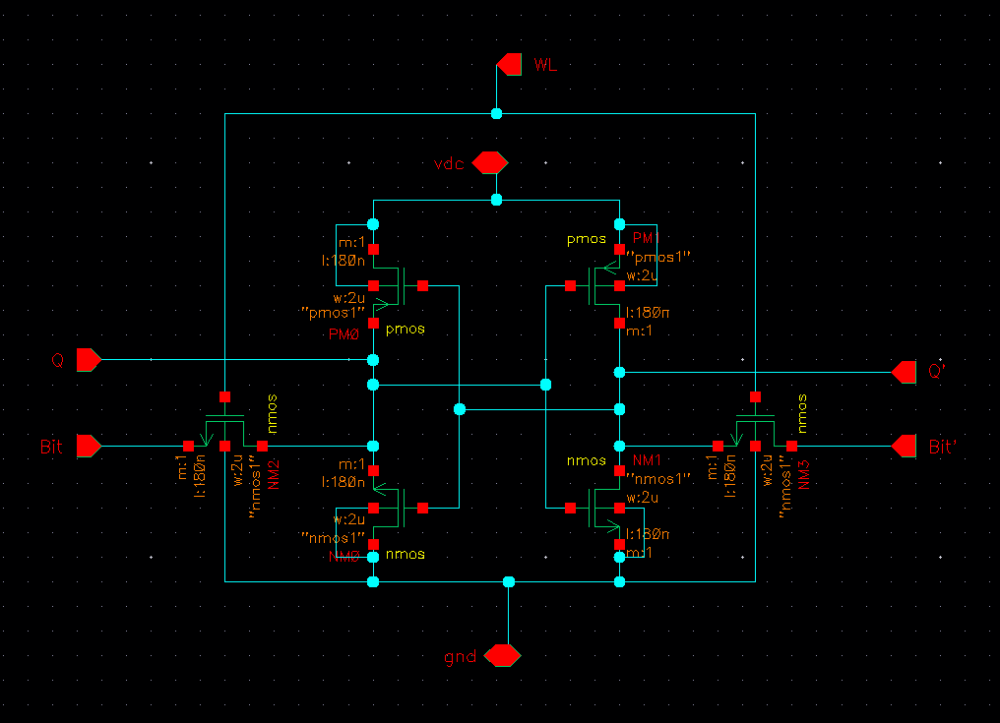
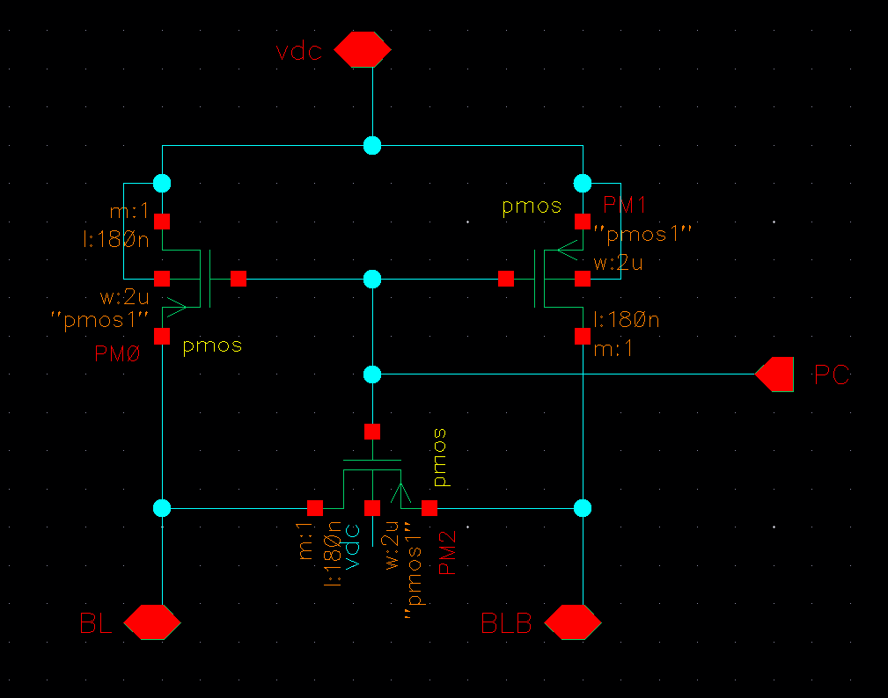
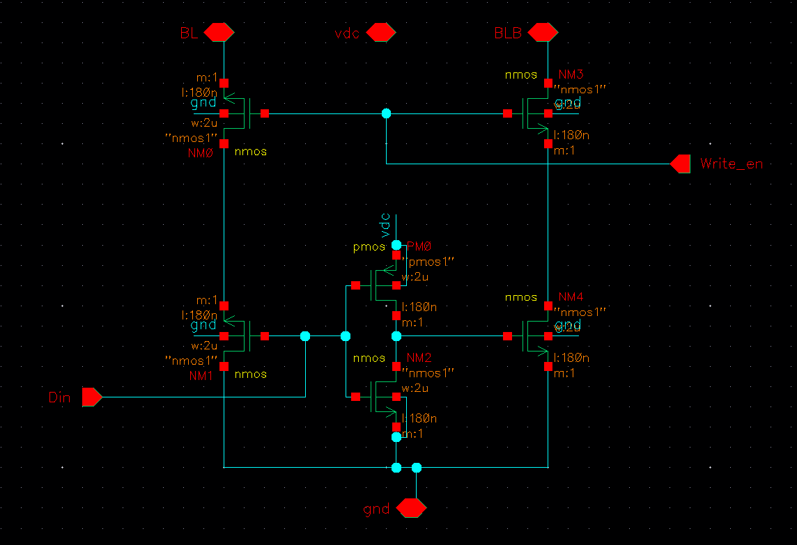
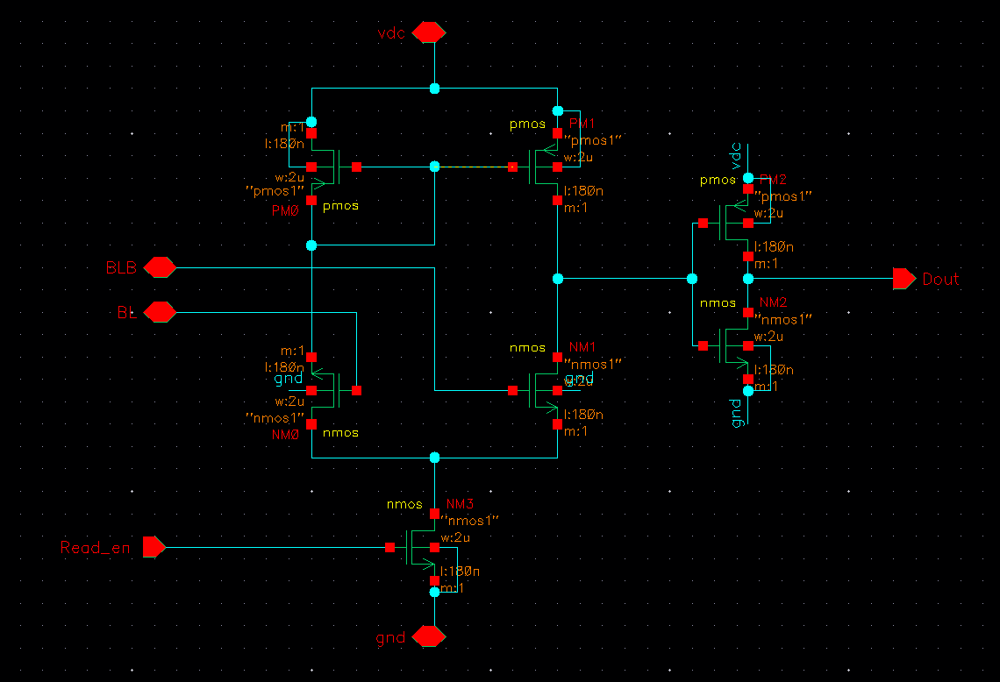
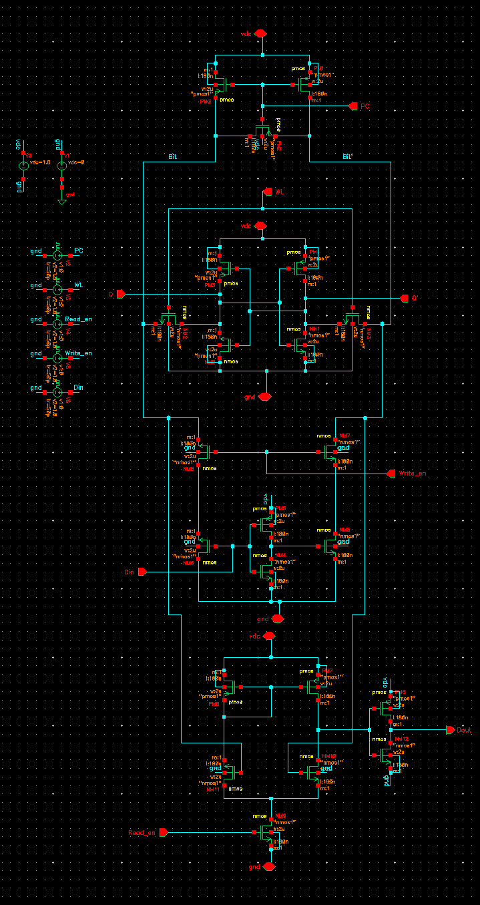
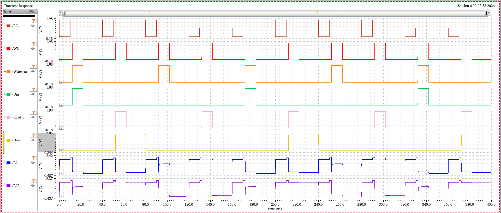

# 1-Bit SRAM Design using 6T Cell — Cadence Virtuoso | gpdk180 
  A complete overview of the design of SRAM (using a 6T cell) and the working of how it stores a single bit. This repository provides a clear explanation of the Precharge Circuit, 6T Cell, Write Driver, and Sense Amplifier, and describes how they work together as an integrated circuit.

## Content :-
1. Introduction on 6T SRAM
2. Architecture of 6T Cell
3. Precharge Circuit
4. Write Driver
5. Sense Amplifier
6. Write operation
7. Read operation
8. Timing Analysis
9. Simulation Results

## Overview of SRAM built using 6T cell which stores a Single bit
  SRAM stands for *Static Random Access Memory*. In this project, I designed a 1-bit SRAM using a 6T cell, which means *six transistors* are connected together to form the core storage element of the circuit. It can also be implemented using an 8T cell or a 10T cell.
It consists of four separate circuits that are integrated together to enable reading and writing of a single bit. They are:
  - Precharge Circuit 
  - 6T cell
  - Write Driver
  - Sense Amplifier

### 6T cell 
  
    The 6T cell is the core storage element where the actual data, i.e., a single bit, is stored. It consists of two CMOS inverters connected to each other in a *cross-coupled manner*, which causes them to behave like a latch. These two CMOS inverters form four of the six transistors, and the remaining two are called *Access Transistors*. The access transistors act as the connection units of the 6T cell, determining whether the storage element (the latch formed by the two cross-coupled inverters) is accessible for read and write operations or completely isolated. The gates of both access transistors are connected together and labeled as the *Word Line (WL)*, which is responsible for connecting and disconnecting the 6T cell from the external circuits (Precharge Circuit, Write Driver, and Sense Amplifier). The Bit Line (BL) and Bit Line Bar (BLB) are connected to the access transistors. It is important to note that BLB is not always the complement of BL — the term "bar" simply refers to the complementary bit line by convention. Based on the voltage variations on BL and BLB, the Sense Amplifier determines the data stored in the cell.

### Precharge Circuit
  
    The Precharge Circuit is responsible for charging the Bit Line (BL) and Bit Line Bar (BLB) to VDD (1.8V in this design) before every read and write operation. It consists of three PMOS transistors — two transistors to connect and disconnect BL and BLB to VDD, and a third transistor called the *Equalizer Transistor*, which ensures that both BL and BLB are at exactly equal voltage before any operation begins. This is important because even a small voltage difference between BL and BLB before the operation can disturb the read or write result.
The Precharge Circuit uses PMOS transistors instead of NMOS because PMOS transistors are good at pulling nodes up toward VDD — they are called pull-up transistors. If NMOS were used instead, BL and BLB could never be charged to the full VDD due to the threshold voltage drop of NMOS.
The control input of the Precharge Circuit is PC (Precharge Control). Since PMOS is active low:
- PC = 1 (1.8V) → all three PMOS transistors turn OFF → BL and BLB are disconnected from the precharge circuit → read or write operation can proceed freely
- PC = 0 (0V) → all three PMOS transistors turn ON → BL and BLB are connected to VDD and charged to 1.8V
  An important characteristic of *BL and BLB is that they possess Parasitic Capacitance* — a natural property of every wire in a circuit. This capacitance holds the charge on BL and BLB even after the precharge circuit disconnects, allowing them to remain at VDD long enough for the read or write operation to complete successfully. This is a key property that makes the SRAM operation reliable.

### Write Driver
  
    The Write Driver is the circuit responsible for writing data into the 6T cell through the Bit Line (BL) and Bit Line Bar (BLB). It has a control input called Write Enable (WE), which connects and disconnects the Write Driver from BL and BLB.
- Write Enable = 1 (1.8V) → Write Driver is connected to BL and BLB → data provided at the Din (Data Input) pin is written into the 6T cell
- Write Enable = 0 (0V) → Write Driver is disconnected from BL and BLB → no write operation is performed
  Internally, the Write Driver contains an inverter that generates the complement of Din. This ensures that BL and BLB are always driven to opposite values simultaneously:
- Din = 1 (1.8V) → BL = 1.8V, BLB = 0V → cell stores 1
- Din = 0 (0V) → BL = 0V, BLB = 1.8V → cell stores 0 

### Sense Amplifier
  
   The Sense Amplifier is a circuit that detects and amplifies the small voltage difference between the Bit Line (BL) and Bit Line Bar (BLB) in order to determine the data stored in the 6T cell and produce a clean digital output.
During a read operation, the Word Line (WL) is activated, connecting the 6T cell to BL and BLB. Based on the data stored in the cell, one of the bit lines drops slightly in voltage while the other remains near VDD. For example:
- Cell stores 1 → BLB drops slightly → BL > BLB → Sense Amplifier outputs 1
- Cell stores 0 → BL drops slightly → BLB > BL → Sense Amplifier outputs 0
  This voltage difference is very small — typically around 100mV — and cannot be used directly as a logic output. The Sense Amplifier detects this tiny difference and snaps it to a clean logic level of either 0V or 1.8V, which is the final read output called Dout.
The control input of the Sense Amplifier is Read Enable (RE). Similar to Write Enable in the Write Driver:
- Read Enable = 1 (1.8V) → Sense Amplifier is activated → detects difference between BL and BLB → Dout is valid
- Read Enable = 0 (0V) → Sense Amplifier is inactive → Dout is invalid

### SRAM design to store a single bit
  The complete integrated schematic of the 1-bit SRAM consisting of all four blocks — Precharge Circuit, 6T Cell, Write Driver, and Sense Amplifier — is shown below.
  

#### Write Operation
  To write a bit into the SRAM cell, the Precharge Circuit first charges BL and BLB to VDD. Once precharge is complete, the Write Driver is activated by pulling Write Enable HIGH, which forces BL and BLB to opposite values based on Din. The Word Line is then pulled HIGH, connecting the 6T cell to BL and BLB, and the data is written into the cell. Once the write is complete, WL is pulled LOW, isolating the cell and holding the data safely.
  
#### Read Operation
  To read the stored bit, the Precharge Circuit charges BL and BLB to VDD again. Once precharge is complete, the Word Line is pulled HIGH, connecting the cell to BL and BLB. Based on the stored data, one of the bit lines drops slightly in voltage. The Sense Amplifier is then activated by pulling Read Enable HIGH, which detects this small voltage difference and produces a clean digital output at Dout.
  
#### Timing Analysis
  The order of control signals is critical for correct SRAM operation. The complete timing sequence is:
  - PC = LOW → Precharge ON → BL and BLB charged to VDD
  - PC = HIGH → Precharge OFF → BL and BLB float at VDD
  - Write Enable = HIGH + WL = HIGH → Write operation performed
  - PC = LOW again → Second precharge → BL and BLB reset to VDD
  - PC = HIGH → Precharge OFF
  - Read Enable = HIGH + WL = HIGH → Read operation performed → Dout valid
  
#### Output Waveform
  
  
#### Simulation Results
  The transient simulation was performed in Cadence Virtuoso ADE using the gpdk180 process library at 1.8V supply. The waveform above shows the complete write followed by read operation, confirming correct functionality of the 1-bit SRAM.

### References 
  1.For concepts
  - Weste, N. H. E., & Harris, D. — CMOS VLSI Design: A Circuits and Systems Perspective
  - Youtube playlist - *in 5 minutes*
    [Watch here](https://youtube.com/playlist?list=PLRvusBxa2-SuGnxi-qAVO6rTNwBZdAF0w&si=4XhlFVw93QXXhBbS)
    
  2.For Schematics and design 
  - Github repositories - Implementation of SRAM using 6T cell
    
    

  
